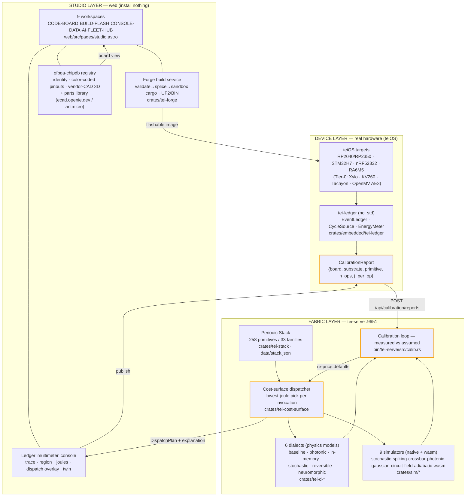
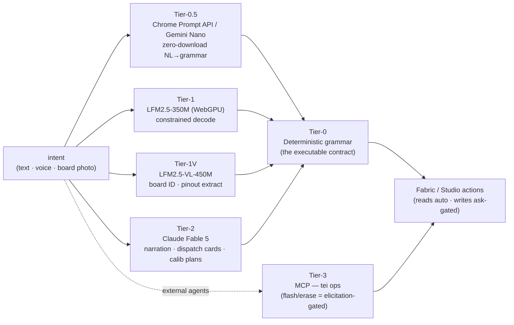

# TEI Studio — System Map & Landscape (internal)

> **Internal strategy doc.** Competitor names appear here for positioning and
> must never reach a public page (`feedback-no-comparative-marketing`,
> `feedback-no-internal-deploy`). Lives in `docs/` alongside EMBEDDED-ROADMAP,
> STUDIO-DESIGN, SIM-ROADMAP — version-controlled, never deployed.

## Thesis

**TEI Studio is an AI-first design suite for energy-optimized compute on real
hardware.** You connect (or simulate) a board, author for it in natural language,
build and flash from the browser with nothing installed, and watch what it does
**measured in joules** — then the fabric dispatches each operation to the
lowest-energy substrate the board actually has.

Four pillars set it apart from everything else in the field:

1. **Joules are the unit.** Not lines of code, not MHz, not inferences/sec —
   energy. Every primitive is priced; every run produces an energy ledger; every
   dispatch picks the lowest-joule substrate.
2. **AI-first authoring.** A four-tier router turns intent into the deterministic
   command grammar, explains dispatch decisions, generates calibration plans, and
   identifies a board from a photo — locally first, frontier when needed.
3. **Measured, not assumed.** Device ledgers flow back and re-price the cost
   surface, so estimates converge to hardware truth over time.
4. **Substrate-spanning.** CPU/GPU, photonic, in-memory, stochastic, reversible,
   neuromorphic — plus FPGA fabric and neuromorphic ASICs — under one model, not
   just MCUs.

---

## System map

**The closed loop (the spine of the whole thing):** dispatch prices a workload in
joules using literature/Table-tier substrate constants → the board (or a
simulator) runs it and emits a measured `EventLedger` → that becomes a
`CalibrationReport` → posted back, it re-prices the cost surface → the next
dispatch is cheaper and more honest. *Measured, not assumed.*

---

## The AI-first spine

AI is not a chat bubble bolted on; it's a tiered router that always resolves to
the **deterministic command grammar** (the contract the fabric executes). Locally
first, frontier only when needed, and **AI stages physical actions but never
initiates them** (`origin: ai-proposed, approved-by: user`). Source:
`docs/STUDIO-DESIGN.md §5`.

Where it lands per workspace: **AI** (Command-K NL→grammar, model dev/deploy),
**CONSOLE** (dispatch-decision + anomaly explanation cards, evidence-linked to
ledger rows), **BOARD** (photo→identify, datasheet/pinout extraction), **BUILD**
(NL→forge recipe, v2). The grammar is always the floor — the LLM interprets, it
never executes.

---

## Landscape comparison

Honest read of where each player is strong. ✓ = core strength, ◐ = partial /
emerging, ✗ = not their game.

| Capability | **TEI Studio** | Antmicro | Wokwi | Arduino Cloud / PlatformIO | ESP Web Tools / esptool-js | Edge Impulse | Particle / Golioth / Memfault |
|---|---|---|---|---|---|---|---|
| Board coding / authoring | ✓ AI→grammar | ◐ System Designer (visual) | ✓ in-sim code | ✓ editor / pro IDE | ✗ | ◐ ML blocks | ◐ device SDK |
| Build / compile | ✓ cloud forge, no install | ◐ Zephyr/west | ◐ via PIO/Arduino | ✓ 1500+ boards | ✗ | ✓ firmware export | ◐ cloud compile (Particle) |
| Flashing (web) | ✓ UF2/WebUSB/WebDFU ladder | ✗ (probe/Renode) | ✓ WebSerial | ◐ IDE-driven | ✓ the web-flash standard | ◐ via tooling | ✓ DFU/OTA |
| Simulation | ◐ 9 substrate sims (wasm) | ✓ **Renode** (deep, multi-node) | ✓ **deep peripheral/RF** | ✗ (PIO uses Wokwi) | ✗ | ✗ | ✗ |
| Edge-AI deploy | ◐ ONNX import + dispatch | ✓ Kenning + open AutoML | ✗ | ◐ libraries | ✓ **production AutoML** | — | ◐ |
| Monitoring & fleet / OTA | ◐ HUB + reports (FLEET stub) | ✓ RDFM OTA | ✗ | ◐ Arduino Cloud | ✗ | ✓ device data | ✓ **fleet/observability** |
| **Energy (joules) as the unit** | ✓ **core thesis** | ✗ | ✗ | ✗ | ✗ | ◐ rough power est | ◐ battery telemetry |
| **AI-first authoring** | ✓ **four-tier router** | ✗ | ✗ | ✗ | ✗ | ◐ AutoML (not authoring) | ✗ |
| Substrate span | ✓ CPU→photonic→neuromorphic→FPGA | ◐ MCU/FPGA via Renode | ◐ MCU families | ◐ MCU | ✗ ESP-only | ◐ MCU/NPU | ✗ MCU/SBC |
| Install footprint | ✓ **browser-only** | ✗ desktop | ✓ browser | ◐ IDE/CLI | ✓ browser | ◐ studio+CLI | ◐ SDK/agent |
| Openness | ◐ open core | ✓ **fully open** | ◐ freemium | ◐ mixed | ✓ open | ✗ SaaS | ✗ SaaS |

---

## The wedge

Each incumbent owns **one slice**: Wokwi = simulation, Arduino/PlatformIO = code,
ESP Web Tools = flashing, Edge Impulse = ML deploy, Particle/Golioth/Memfault =
fleet & observability, Antmicro = the open-source full lifecycle. They're strong
and mature in their lane.

**Nobody makes joules the unit, and nobody is AI-first at the authoring layer.**

That's the category we create: **energy-priced, AI-authored hardware design** —
one suite that unifies code → build → flash → **measure (in joules)** → dispatch
around a single energy ledger, with AI as the authoring surface and a closed
calibration loop that turns assumptions into hardware-measured truth.

**Antmicro is a complement, not a rival.** We already federate their open
`hardware-components` parts index; Renode is a natural simulation *backend* behind
our cost surface, not a competitor to it. The honest framing is "we add the
energy + AI authoring layer on top of an open hardware stack," and Antmicro is the
best example of that stack.

---

## Where the SOTA leads us today (roadmap, not defeat)

- **Wokwi** — far deeper, mature visual peripheral/RF simulation + a huge
  component library. Our 9 sims are physics-accurate but not a drag-and-drop
  virtual breadboard yet.
- **PlatformIO** — 1500+ board reach. Our forge builds 7 board families today.
- **Edge Impulse** — production-grade AutoML + data pipeline. Our edge-AI path is
  ONNX-import + dispatch, not training.
- **Antmicro Renode / RDFM** — battle-tested multi-node simulation and fleet OTA.
  Our FLEET and DATA workspaces are still stubs.
- **Hardware verification** — most teiOS firmware (E1b–E1d) is *compile-verified,
  not yet hardware-verified*; joules ship Table-tier until bench calibration
  (INA228 / PMIC ADC / board AEM) replaces literature constants.

None of these are the wedge. Closing them makes the suite complete; the wedge is
why anyone switches.

---

## So what (one line)

> The first hardware design suite where you author in natural language, run on
> anything from a $4 MCU to a photonic mesh, and the unit of truth is **joules** —
> measured, not assumed.
