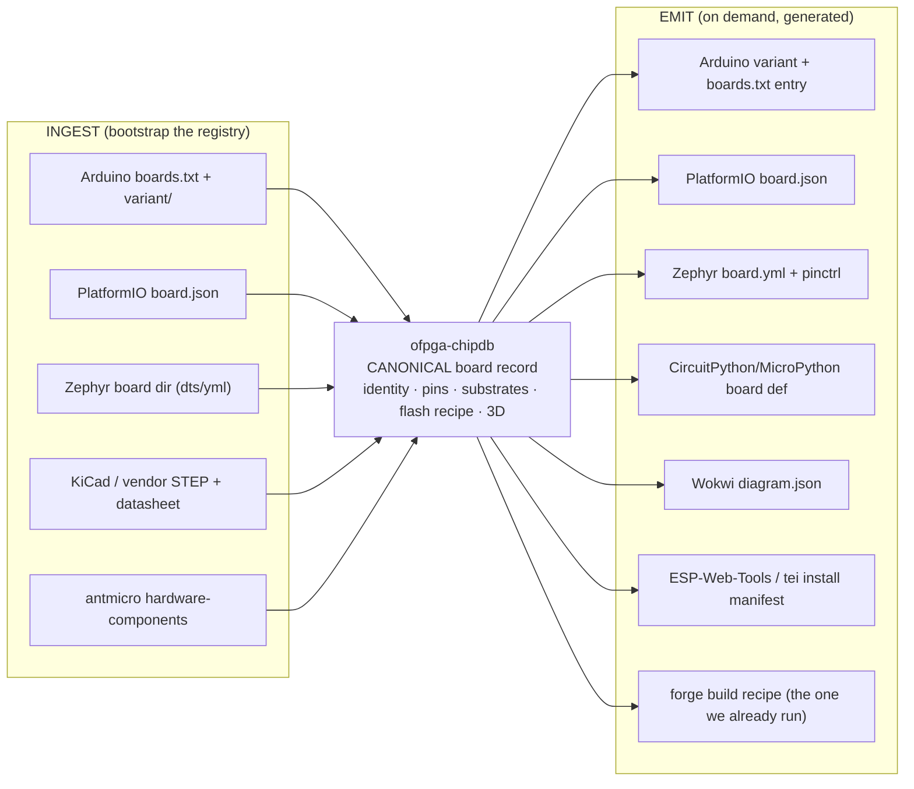

# TEI Studio — Becoming SOTA by Ingestion (internal)

> Internal design doc (companion to `LANDSCAPE.md`). How Studio reaches and
> passes the state of the art by **ingesting the best of every ecosystem** and
> **erasing the per-ecosystem maintenance noise** — instead of reimplementing one
> tool. Competitor/ecosystem names are for design only; never ship them to a
> public page.

## The problem: N ecosystems × M boards = N×M maintained definitions

Every embedded ecosystem makes you maintain *its own* copy of the same board:

- **Arduino** — a core/BSP: `boards.txt` + `platform.txt` + per-board `variant/`
  pin files + a bootloader.
- **PlatformIO** — a `board.json` manifest (mcu, f_cpu, upload protocol,
  frameworks) inside a platform package. (Community literally asks for a
  `boards.txt → board.json` sync script — the duplication is a known pain.)
- **Zephyr** — a board directory: `board.yml`, devicetree `.dts`, `defconfig`,
  `Kconfig`, `pinctrl`.
- **CircuitPython / MicroPython** — a per-board port (`pins.c`,
  `mpconfigboard.{h,mk}`, `board.c`) compiled into per-board firmware.
- **Wokwi** — a board/chip model + `diagram.json`.
- **ESP Web Tools** — a per-board flash `manifest.json`.

Same board. Six+ definitions, six+ toolchains, six+ flash tools, six+ library
managers. **That is the noise.** None of it is the thing the user wants to do —
which is get a board doing something useful, measured, fast.

## The principle

> **Studio is the single source of truth that ingests the best of each ecosystem
> and emits what each one needs — so the developer never maintains a board
> definition, installs a core, or picks a flasher again.**

`ofpga-chipdb` already holds the canonical board record (identity, pins,
substrates, flash path). Make it the **board-definition compiler**: ingest
existing defs to bootstrap, emit every ecosystem's artifact on demand.

Add a board **once**; every ecosystem is supported. That single feature subsumes
the board-maintenance noise of the entire field, and it's the most leveraged SOTA
move we can make.

## Best-of-breed ingestion map

For each ecosystem: the loved feature to match/ingest · the noise it imposes ·
how Studio absorbs it (✓ have · ◐ partial · ○ to build).

| Ecosystem | Loved feature (ingest this) | Noise it imposes | Studio absorbs via |
|---|---|---|---|
| **Adafruit / CircuitPython** | drag-drop UF2 · live REPL · world-class Learn guides · "it just works" | per-board CP firmware + board def; guides are manual | ✓ UF2 flash ladder · ◐ BOARD view as the living guide · ○ WebSerial REPL · ○ emit CP board def |
| **Arduino** | Library Manager · boards manager · dead-simple · huge reach | cores/BSP/`boards.txt`/variant per board | ✓ chipdb = board def · ✓ forge = build · ◐ parts library = libs · ○ emit Arduino variant |
| **PlatformIO** | 1500+ boards · one `platformio.ini` · pro tooling | a `board.json` per board, per platform | ✓ forge = unified build · ○ ingest+emit `board.json` (the sync everyone wants) |
| **Wokwi** | instant simulation · `diagram.json` · share-a-link · chip API | per-board/chip sim models | ◐ 9 substrate sims (wasm) · ○ visual diagram from chipdb · ○ shareable sim links |
| **ESP Web Tools / Improv** | web flash · Wi-Fi provisioning in-browser · embeddable install button | per-board flash manifest | ✓ FLASH ladder + `<tei-install-button>` · ○ Improv provisioning · ✓ emit manifest from chipdb |
| **Edge Impulse** | data → DSP → model → deploy · EON compiler · device data | per-board deployment lib | ◐ ONNX import + dispatch · ○ DATA capture loop · ○ on-device train/deploy |
| **Antmicro** | Renode sim · System Designer · Kenning AutoML · RDFM OTA · open parts DB | open but desktop, separate tools | ✓ federate hardware-components · ◐ BOARD+placement ≈ System Designer · ○ Renode as a sim backend |
| **Particle / Golioth / Memfault** | fleet · OTA · crash/coredump observability | SDK/agent per board | ◐ HUB + calibration reports · ○ FLEET (OTA + fleet ledgers) |

**The pattern:** every ecosystem's *best* feature is a thin layer over a board
definition + a transport + a workflow. We own the canonical board definition
(chipdb) and the transports (forge build, WebSerial/UF2/DFU flash, the ledger).
So we can ingest each best-feature without inheriting its noise.

## The streamlined workflow (the payoff)

One flow, no per-ecosystem ceremony:

1. **Connect / simulate** — one button; chipdb identifies the board.
2. **Author** — AI→grammar, in *any* language the board supports (Rust today;
   C/Arduino, MicroPython, CircuitPython as emitters land) — you never install a
   core or a toolchain.
3. **Build** — the forge, any framework, in the cloud — no local SDK.
4. **Flash** — the capability ladder (UF2 → WebUSB → WebDFU → probe), one button.
5. **Measure** — the ledger console, **in joules**.
6. **Dispatch** — lowest-energy substrate the board actually has.

The developer never touches a `boards.txt`, a `board.json`, a Zephyr dts, a
`platformio.ini`, `bossac`/`esptool`/`dfu-util`, or a per-ecosystem library
manager. That maintenance is the product's job, done once in chipdb.

## SOTA gap roadmap (prioritized)

Ordered by leverage — each closes a "where SOTA leads us" item from `LANDSCAPE.md`.

1. **Board-definition compiler** (chipdb emitters + ingesters) — *the keystone.*
   Ingest `boards.txt`/`board.json`/Zephyr to bootstrap; emit
   Arduino-variant / PlatformIO-JSON / CircuitPython-def / Wokwi-diagram /
   install-manifest. One board → every ecosystem. Subsumes the most noise.
2. **Multi-language authoring** — forge skeletons + emitters for Arduino-C and
   MicroPython/CircuitPython, not just Rust. Matches Arduino/Adafruit reach.
3. **WebSerial REPL** — the CircuitPython/MicroPython live-coding loop, in CONSOLE.
4. **Visual diagram + share** — generate a Wokwi-style `diagram.json` from chipdb
   + the placement map; shareable sim links. Closes the Wokwi UX gap.
5. **DATA + on-device train/deploy** — the Edge Impulse loop (capture → model →
   deploy), on top of ONNX import + the ledger.
6. **Renode as a sim backend** — wrap Antmicro Renode behind the cost surface for
   instruction-accurate runs where our physics sims don't reach.
7. **FLEET (OTA + fleet ledgers)** — Improv provisioning, OTA, fleet-wide joule
   dashboards. Closes the Particle/Golioth/Memfault gap.

## Why this is SOTA, not catch-up

Matching features one-by-one would make us a worse copy of six tools. **Ingesting
them through one canonical board record makes us the layer they all should have
had** — and we add the two things none of them have: **joules as the unit** and
**AI-first authoring**. The board-definition compiler is the move that turns "all
that noise" into "added once, works everywhere, measured in energy."

## So what (one line)

> Add a board once; author in any language by talking to it; build, flash, and
> measure it in joules from the browser — Studio maintains the six ecosystem
> definitions so you never see them.
