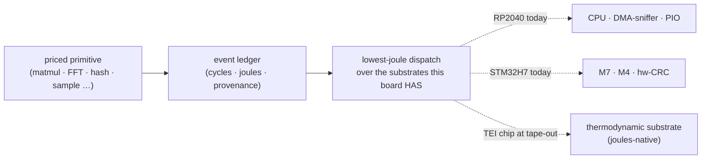

# teiOS — the adoption on-ramp for a new class of chip (internal)

> Internal strategy doc (companion to `LANDSCAPE.md`). Why teiOS runs on existing
> boards, and what "SOTA" actually means for us. Ecosystem names are for design
> reference only — never ship them to a public page.

## What we're actually doing

**ThermoEdge is building a new class of chip that doesn't exist yet** — energy /
thermodynamic compute silicon (tesilicon.thermoedge.ai · thermoedge.ai). Same
frontier as Extropic, Unconventional AI: a part whose unit of work is *joules*,
not instructions.

**New-silicon companies die on adoption, not physics.** History is full of
brilliant chips that went bankrupt because nobody adopted them — no software, no
ecosystem, no installed base, no developers who think in the new model. Taping
out the part is the easy half.

**teiOS is our adoption strategy.** It is the runtime for our future silicon —
and we ship it *today* on the boards people already own and deploy. On those
boards teiOS delivers the **best possible use of the hardware**: every operation
is a priced primitive, every run emits an energy ledger, every dispatch picks the
lowest-joule substrate the board actually has. By the time our chip tapes out,
there is already a population of developers fluent in the teiOS model, with teiOS
code and an energy-first mental model — and the chip is just the best substrate
the same code can dispatch to.

> **Existing-board teiOS is the on-ramp, the proving ground, and the installed
> base — not a destination, and never an interop layer for other people's tools.**

## What "SOTA" means here (and what it does NOT)

It does **not** mean speaking six ecosystems' board-definition formats. Emitting
Arduino `variant/` files or PlatformIO `board.json` would make us a maintenance
tool serving *rival* ecosystems — busy-work that dilutes the thesis. **People use
teiOS.** We don't generate other people's files. (The earlier "board-definition
compiler" idea is retracted.)

It **does** mean: **teiOS on an existing board is the easiest, best way to use
that board** — so adoption is frictionless and the energy-first model spreads
before the silicon ships. We benchmark against the *ease* of the best ecosystems
and deliver that ease through the teiOS model — we ingest the **UX, not the file
formats**.

## The constant that carries to silicon

The teiOS model is identical on a $4 MCU and on the future TEI chip:

Same primitives, same code shape, same energy unit. The substrate set grows; the
program and the developer's fluency don't change. That is *why* MCU adoption
transfers to the chip — and why every existing-board feature must reinforce the
energy model, not wander off into ecosystem interop.

## Ingestion map — match the EASE, deliver it as teiOS

For each ecosystem: the *ease* that makes it loved (the bar to clear so teiOS
adoption is frictionless) → how teiOS Studio delivers that ease on existing
boards. ✓ have · ◐ partial · ○ to build. **No "emit their format" rows.**

| Ecosystem | The ease to match | teiOS delivers it via |
|---|---|---|
| **Adafruit / CircuitPython** | drag-drop UF2 · live REPL · world-class guides · "it just works" | ✓ UF2/WebDFU flash ladder · ○ WebSerial REPL · ◐ BOARD view as the living guide |
| **Arduino** | one-click simplicity · huge reach | ✓ cloud forge build · ✓ one-button flash · ○ teiOS apps in C, not just Rust |
| **PlatformIO** | same flow across many boards | ✓ chipdb + forge across boards (7 families, growing) |
| **Wokwi** | instant simulation · share-a-link | ◐ substrate sims (wasm) · ✓ board+peripheral diagram **+ share links (shipped)** |
| **ESP Web Tools / Improv** | web flash · in-browser Wi-Fi provisioning | ✓ flash ladder + `<tei-install-button>` · ○ Improv provisioning |
| **Edge Impulse** | data → model → deploy is effortless | ◐ ONNX import + dispatch · ○ capture→deploy, **measured in joules** |
| **Antmicro** | open, full-lifecycle | ✓ federate their open parts index · ○ Renode as an optional sim backend |

The point of the table is a **friction bar**, not a feature-parity checklist:
where any of these is easier than teiOS, that's an adoption leak to close.

## On-ramp roadmap (lower friction · deepen the energy model)

Every item makes teiOS the best use of an existing board *and* strengthens the
model that the new chip will run. Ordered by adoption leverage.

1. **Multi-language teiOS authoring** — let Arduino-C and MicroPython/
   CircuitPython developers write *teiOS apps in their language* (the priced-
   primitive / ledger / dispatch API, not a transpiler to their ecosystem). Meets
   the largest installed base where they are.
2. **WebSerial REPL** — the CircuitPython/MicroPython live-coding feel, talking to
   a teiOS board interactively. Lowest-friction "it's alive" moment.
3. **Measured joules** — close the calibration loop on real boards (INA228 / PMIC
   ADC / board AEM) so the ledger is *measured*, not Table-tier. This is the proof
   the whole thesis rests on; it must be real before the chip's numbers are
   credible.
4. **Visual diagram + share** — ✓ shipped. Keep deepening (sim-from-diagram).
5. **Frictionless first-run** — connect → auto-identify → flash known-good →
   proof-of-life ledger, no account. The five-beat grammar from STUDIO-DESIGN.
6. **Edge-AI deploy, energy-measured** — ONNX → dispatch with a real joules
   readout per inference. The differentiator vs every edge-AI tool: we show the
   energy, they don't.

## The bridge to silicon

When the TEI chip tapes out, nothing about the developer's world changes: the
cost table gains a thermodynamic substrate, the same primitives dispatch to it,
the same ledger measures it in joules. Adoption built on commodity MCUs *is* the
adoption of the chip. That bridge — a real software runtime + an energy model +
an installed base, in hand before the silicon — is the thing the bankrupt
new-chip companies never had.

## So what (one line)

> teiOS makes the boards you already own do their best energy-work today — and
> teaches the joules-first model our new chip runs tomorrow. The existing-board
> suite is the on-ramp to silicon that no other new-chip company has built.
